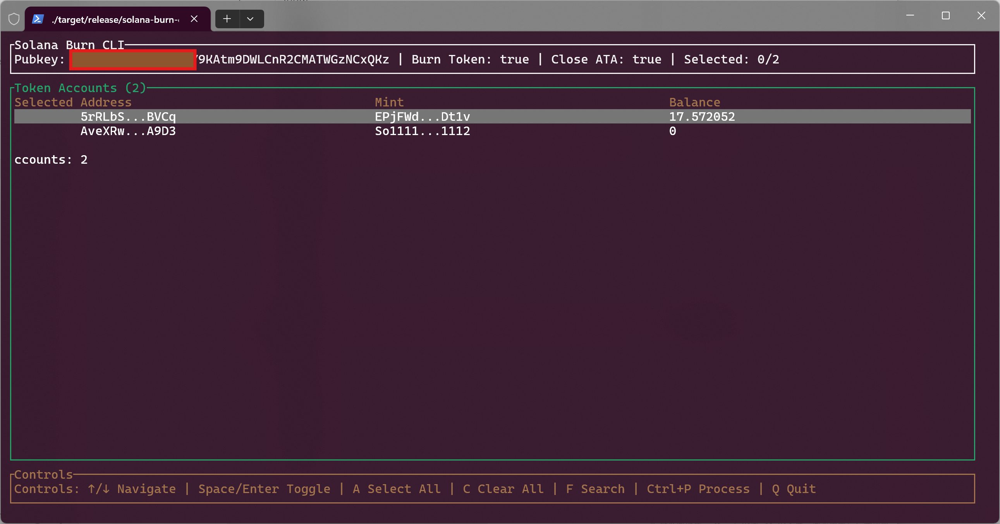

# Solana Burn CLI

[中文文档](README_CN.md) | English

A TUI (Terminal User Interface) tool for burning Solana SPL tokens and closing ATA (Associated Token Account) accounts to recover SOL rent.

## Features

- 🔥 **Token Burning**: Support for burning specified SPL Tokens
- 💰 **ATA Account Closure**: Close Associated Token Accounts and recover SOL rent
- 🖥️ **Terminal Interface**: Modern terminal user interface based on ratatui
- ⚡ **Real-time Data**: Real-time account information via Solana RPC
- 🎯 **Precise Control**: Selectively process specific token accounts
- 🔍 **Search Functionality**: Filter accounts by Mint address
- 🛡️ **Safety Confirmation**: Confirmation dialog before executing operations

## Interface Overview



### Top Information Bar
- Displays wallet public key address
- Shows current settings (burn tokens, close ATA)
- Displays selected account count and total account count
- In search mode: shows search query and filtered results

### Main Table - Token Account List
- Displays all ATA accounts in the wallet
- Columns: Selection status (✓ for selected), Address (first 6...last 4 chars), Mint address, Balance
- Shows total account count

### Bottom Control Bar
- Displays all available keyboard shortcuts

## Controls

### Normal Mode
- `↑/↓`: Navigate up/down in the table
- `Space/Enter`: Toggle selection status of current row
- `A`: Select all accounts
- `C`: Clear all selections
- `F`: Enter search mode (search by Mint address)
- `Ctrl+P`: Show confirmation dialog to process selected accounts
- `Q/Esc/Ctrl+C`: Exit program

### Search Mode
- `Type characters`: Filter accounts by Mint address (partial match, case-insensitive)
- `Backspace`: Delete search characters
- `↑/↓`: Navigate in filtered results
- `Space`: Toggle selection status of current row
- `Enter/Esc`: Exit search mode

### Confirmation Dialog Mode
- `Y/Enter`: Confirm processing selected accounts
- `N/Esc`: Cancel operation and return to main interface

## Usage

### Workflow
1. After starting the program, all token accounts are displayed
2. Use arrow keys to browse the account list
3. **Optional**: Press F to enter search mode and filter by Mint address
4. Press Space or Enter to select/deselect accounts to process
5. Use A to select all or C to clear all selections
6. Press Ctrl+P to show confirmation dialog
7. In the confirmation dialog, press Y to confirm or N to cancel the operation

### Search Functionality
- Press F to enter search mode
- Type any part of a Mint address to filter (case-insensitive)
- Search results update in real-time
- You can still select/deselect accounts in search mode
- Press Enter or Esc to exit search mode

### Safety Confirmation Feature
- Press Ctrl+P to trigger processing operation and show confirmation dialog
- Dialog displays the number of accounts to be processed and operation details
- Clearly shows operations to be performed: burn tokens, close ATA accounts, recover SOL
- Must explicitly confirm (press Y) to execute operations
- Can cancel at any time (press N or Esc)

## Installation and Usage

### Quick Install (Recommended)

#### Linux/macOS
```bash
curl -sSL https://raw.githubusercontent.com/Tallone/solana-burn-cli/main/install.sh | bash
```

#### Windows (PowerShell)
```powershell
iwr -useb https://raw.githubusercontent.com/Tallone/solana-burn-cli/main/install.ps1 | iex
```

### Manual Installation

#### Download Pre-built Binaries
1. Go to the [Releases](https://github.com/Tallone/solana-burn-cli/releases) page
2. Download the appropriate binary for your platform:
   - **Linux x86_64**: `solana-burn-cli-linux-x86_64.tar.gz`
   - **Linux x86_64 (musl)**: `solana-burn-cli-linux-x86_64-musl.tar.gz`
   - **Windows x86_64**: `solana-burn-cli-windows-x86_64.zip`
   - **macOS x86_64 (Intel)**: `solana-burn-cli-macos-x86_64.tar.gz`
   - **macOS aarch64 (Apple Silicon)**: `solana-burn-cli-macos-aarch64.tar.gz`
3. Extract the archive and move the binary to your PATH

#### Build from Source
**Prerequisites**: Rust 1.70+

```bash
git clone https://github.com/Tallone/solana-burn-cli.git
cd solana-burn-cli
cargo build --release
```

**Note for Windows users**: If you encounter OpenSSL build issues, see the [Windows Build Guide](WINDOWS_BUILD.md) for detailed setup instructions.

### Run
```bash
# Basic usage
cargo run -- --private-key <YOUR_PRIVATE_KEY_BASE58> --rpc-url <RPC_ENDPOINT>

# Using devnet
cargo run -- --private-key <YOUR_PRIVATE_KEY_BASE58> --rpc-url https://api.devnet.solana.com

# Using mainnet
cargo run -- --private-key <YOUR_PRIVATE_KEY_BASE58> --rpc-url https://api.mainnet-beta.solana.com
```

### Command Line Arguments
- `-p, --private-key <PRIVATE_KEY>`: Wallet private key (base58 encoded) **[Required]**
- `-r, --rpc-url <RPC_URL>`: Solana RPC endpoint [Default: https://solana-rpc.publicnode.com]

## Safety Warnings

⚠️ **Important Safety Notes**:
- Please test thoroughly on testnet before using on mainnet
- Private key information is sensitive, please keep it secure
- Burned tokens cannot be recovered
- Recommend testing functionality on devnet first

## Tech Stack

- **Rust**: Systems programming language
- **ratatui**: Terminal user interface library
- **tokio**: Async runtime
- **solana-client**: Solana RPC client
- **spl-token**: SPL Token program interface
- **clap**: Command line argument parsing

## License

Copyright (c) Tallone <tallone.shi@outlook.com>

This project is licensed under the MIT license ([LICENSE] or <http://opensource.org/licenses/MIT>)

[LICENSE]: ./LICENSE
